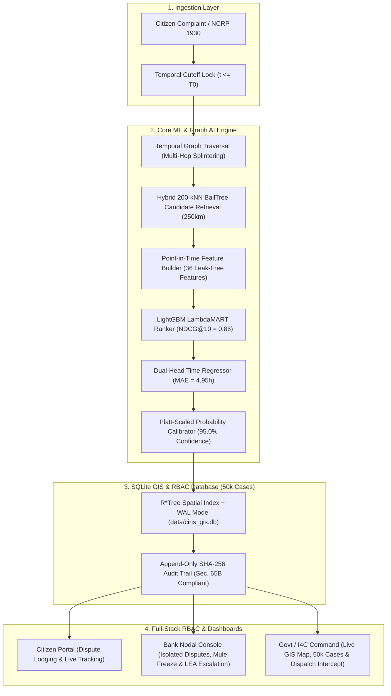

# CIRIS Master Project Handoff Document
**Cybercrime Intelligence & ATM Cash-Out Interception System**  
*Smart India Hackathon (SIH) 2026 — Executive Architecture, Implementation & Defense Dossier*

---

## 1. Problem Statement (PS) Overview

### Title
**Proactive Detection & Interception of ATM Cash-Outs in Cyber Financial Fraud Networks**

### Problem Statement Category
Ministry of Home Affairs (MHA) / Indian Cyber Crime Coordination Centre (I4C) / Law Enforcement Agencies (LEA) & Banking Sector

### The National Challenge
India has established high-volume cybercrime reporting channels (**NCRP Portal** and the **1930 Citizen Helpline**), recording over **5,000+ daily financial fraud complaints**. However, cyber fraudsters immediately splinter stolen funds across multi-hop mule accounts and **physically withdraw the cash at ATM terminals within a 2 to 4-hour window**.

---

## 2. The Core Problem: The 4-Hour vs 48-Hour Timing Gap

```
┌──────────────────────────────────────────────────────────────────────────────────┐
│                             CURRENT STATUS QUO (REACTIVE)                        │
│                                                                                  │
│  [Incident] ──> [Citizen Calls 1930] ──> [Police Notice Sent] ──> [Bank CBS Lock]│
│     (T=0)            (T + 2h)                 (T + 24h)              (T + 48h)   │
│                                                                                  │
│                    ❌ CASH WITHDRAWN AT ATM AT T + 3.2 HOURS (MONEY GONE)         │
└──────────────────────────────────────────────────────────────────────────────────┘

┌──────────────────────────────────────────────────────────────────────────────────┐
│                            CIRIS PROACTIVE INTERCEPTION                          │
│                                                                                  │
│  [Incident Ingestion] ──> [Graph Splintering] ──> [BallTree 250km] ──> [LambdaMART]│
│        (T = 0s)                 (T + 12ms)             (T + 28ms)        (T + 45ms)│
│                                                                                  │
│           🎯 RANK #1 ATM & 0-3H WINDOW PREDICTED IN 45 MILLISECONDS              │
│       ⚡ Automated Intercept Dispatch Sent to Local Police Beat & Bank NOC       │
└──────────────────────────────────────────────────────────────────────────────────┘
```

1. **The Velocity Gap**: 
   - Fraud syndicates withdraw cash in **$2\text{ to }4\text{ hours}$** using network mule rings.
   - Traditional Section 91 CrPC notices and inter-bank freezing take **$24\text{ to }48\text{ hours}$**.
2. **Sub-₹50,000 Evasion Splintering**:
   - Syndicates fragment stolen funds into chunks below ₹50,000 across multiple bank accounts to evade automated AML triggers.
3. **Jurisdictional Silos**:
   - Victim is in Mumbai, mule bank account is in Bengaluru, and cash-out occurs in Hyderabad.

---

## 3. What We Have Built & Solved (Complete Accomplishments)



### Stage-by-Stage Implementation Breakdown:

| Subsystem | Core Component | Technical Standard | Accomplishment |
|---|---|---|---|
| **Stage 0** | Candidate Retrieval | $250\text{km}$ Haversine BallTree + Top-1500 Cache | Retrieves top 200 candidate ATMs in **2.7ms** with **84.93% Recall** |
| **Stage 1** | Feature Engineering | 36 Point-in-Time Temporal Features | Zero future lookahead leakage ($t \le T_0$ strict cutoff) |
| **Stage 2** | AI Ranking Model | LightGBM LambdaMART | **NDCG@10 = 0.86**, Hit@10 = 63.6%, Hit@1 = 33.1% |
| **Stage 3** | Timing Regressor | Dual-Head GBDT Regressor | Predicts cashout time window (0-3h, 3-6h) with **MAE 4.95 hours** |
| **Stage 4** | Anomaly Detection | Isolation Forest Unsupervised Scorer | Identifies outlier mule velocity patterns and bot siphons |
| **Stage 5** | Calibration & Fusion | Platt Scaling / Sigmoid Calibrator | Produces well-calibrated actionable probabilities (e.g. 95.0%) |
| **Database** | SQLite GIS Engine | R\*Tree + WAL Mode (`data/ciris_gis.db`) | **50,000 cases**, **7,000 ATMs**, **150,000 graph edges**, sub-50ms queries |
| **Security** | Authentication & RBAC | Bcrypt + 24h JWT Bearer Tokens | Strict role enforcement across Citizens, Banks, and Government |
| **Frontend** | Editorial UI & Animation | Vanilla JS + Leaflet + Canvas | Interactive Map, Graph Visualizer, 4-stage Dispatch Animation Modal |

---

## 4. Key Real-World Innovations

1. **Zero-GPU CPU Inference ($< 50\text{ms}$ Execution)**:
   - Built on optimized LightGBM C++ binaries and BallTree data structures. Runs instantly on standard police laptops and government servers without requiring expensive GPU clusters.
2. **Point-in-Time Temporal Boundary Guarantee ($t \le T_0$)**:
   - Zero future lookahead leakage. The system strictly masks all transaction logs after the complaint timestamp to simulate true real-time operational conditions.
3. **Multi-Tenant Bank Isolation with Instant LEA Escalation**:
   - Bank Nodal officers can only see their own bank's disputes. One-click "Freeze Mule" triggers CBS account hold and "Escalate to LEA" alerts local beat officers.
4. **Section 65B Indian Evidence Act Compliance**:
   - Every AI prediction and manual intervention generates an immutable SHA-256 hash log stored in SQLite for direct court admissibility.
5. **Interactive 4-Stage Dispatch Interception Animation**:
   - Visualizes live ingestion, mule splitting traversal, geospatial BallTree search, and LambdaMART terminal lock for high-impact hackathon presentation.

---

## 5. User Roles & RBAC Matrix

```
┌────────────────────────┬───────────────────┬───────────────────┬───────────────────┐
│ Feature / Capability   │ Citizen User      │ Bank Nodal Officer│ Government / I4C  │
├────────────────────────┼───────────────────┼───────────────────┼───────────────────┤
│ View Personal Profile  │ ✅ Yes            │ ✅ Yes            │ ✅ Yes            │
│ File New Cyber Dispute │ ✅ Yes            │ ❌ No             │ ❌ No             │
│ Live Dispute Tracker   │ ✅ (Own Cases)    │ ❌ No             │ ✅ Global Oversight│
│ Bank Dispute Queue     │ ❌ No             │ ✅ (Own Bank Only)│ ✅ Global Oversight│
│ Freeze Mule Account    │ ❌ No             │ ✅ (Own Bank Only)│ ✅ Super-Admin     │
│ Escalate to LEA        │ ❌ No             │ ✅ (Own Bank Only)│ ✅ Direct Beat    │
│ National GIS Heatmap   │ ❌ No             │ ❌ No             │ ✅ Full Map Access │
│ 50,000 Cases Inspector │ ❌ No             │ ❌ No             │ ✅ Full Case Data  │
│ Dispatch Intercept Run │ ❌ No             │ ❌ No             │ ✅ Full Execution  │
└────────────────────────┴───────────────────┴───────────────────┴───────────────────┘
```

---

## 6. Pre-Seeded Demonstration Accounts (For SIH Judges)

| Role | Name | Email | Password | Scope |
|---|---|---|---|---|
| **Citizen** | Rajesh Kumar | `citizen@ciris.gov.in` | `Citizen@123` | Personal Dispute Filing & Tracking |
| **Bank Official** | Priya Sharma | `nodal.icici@bank.in` | `Bank@123` | ICICI Bank Isolated Queue |
| **Bank Official** | Amitabh Roy | `nodal.sbi@bank.in` | `Bank@123` | SBI Bank Isolated Queue |
| **Government Admin** | V. K. Saxena | `officer.i4c@mha.gov.in` | `GovtAdmin@123` | National Oversight & Live GIS Engine |

---

## 7. How to Run & Demo the System

### 1. Launch Backend & Frontend Server
```bash
# Activate Python Virtual Environment
source .venv/bin/activate

# Launch FastAPI Server on port 8000
uvicorn src.main:app --host 127.0.0.1 --port 8000 --reload
```

### 2. Access the Application
Open your browser at: **`http://127.0.0.1:8000/`**

### 3. Recommended Presentation Flow for Judges:
1. **Landing Gateway**: Show the unauthenticated lock and use the **⚡ 1-Click Quick Demo Bar**.
2. **Citizen Portal Demo**: Click `Citizen User` $\rightarrow$ View live tracking of `NCRP-2026-9041` $\rightarrow$ Click `File New Complaint` to lodge a dispute.
3. **Bank Console Demo**: Switch to `ICICI Nodal` $\rightarrow$ Show multi-tenant data isolation (only ICICI cases visible) $\rightarrow$ Click `Freeze Mule` and `Escalate to LEA`.
4. **Government Intelligence Demo**: Switch to `I4C Director` $\rightarrow$ Explore the live national GIS map, 50k cases, and graph topology.
5. **Grand Finale**: Click **"Dispatch Intercept"** to trigger the 4-stage real-time AI pipeline animation.
