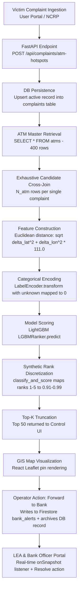

# SKYVAR Repository Audit and Comparison

## Executive Summary

This document presents an exhaustive, source-code-level audit of the three SKYVAR/CIPHER repositories submitted for Smart India Hackathon (SIH) 2025:
1. `CIPHER-main/`
2. `CIPHER-25257-main/`
3. `CIPHER_FINAL_2025-main/`

The audit evaluates concrete code implementations, executable logic, schemas, configurations, ML pipelines, and model artifacts rather than high-level claims in documentation.

---

## 1. Repository Inventory and Structure

### 1.1 Structural Topology

| Dimension | `CIPHER-main/` | `CIPHER-25257-main/` | `CIPHER_FINAL_2025-main/` |
| :--- | :--- | :--- | :--- |
| **Top-Level Structure** | Clean monorepo containing 3 distinct subsystems (`control_layer/`, `lea_portal/`, `user_layer/`) | Single nested folder (`CIPHER-25257-main/`) containing only the control layer | Nested folder (`CIPHER-25257/`) containing control layer, an empty directory (`cipher-userPortal/`), and root stub `package.json` |
| **Total Non-Ignored Files** | 117 files | 65 files | 67 files |
| **Control Layer Files** | 66 files | 65 files (includes `traceback.txt`) | 65 files (includes `traceback.txt`) |
| **LEA Portal Files** | 28 files (React + Vite + Firebase) | 0 files (Missing) | 0 files (Missing) |
| **User Layer Files** | 23 files (Vanilla JS/Vite + FastAPI) | 0 files (Missing) | 0 files (Empty directory stub) |
| **Path Portability** | Fully portable (dynamic relative paths via `pathlib.Path`) | Hardcoded Windows paths (`C:/Users/SRIVANDHI/...`) | Hardcoded Windows paths (`C:/Users/SRIVANDHI/...`) |

### 1.2 File-by-File Difference Analysis

Comparing files across all three repositories reveals that the core control layer codebase is largely shared, with specific critical deviations:

1. **`backend/main.py`**:
   - **`CIPHER-main/control_layer/backend/main.py`** (SHA256 `b2415204...`, 13,463 bytes): Upgraded with dynamic `Path(__file__).parent.parent` resolution for log files (`debug_val_error.log`, `debug_err.log`) and runtime `sys.path.insert(0, parent_dir)` import resolution.
   - **`CIPHER-25257-main` & `CIPHER_FINAL_2025-main`** (SHA256 `81ce83b0...`, 13,037 bytes): Contain hardcoded absolute paths `C:/Users/SRIVANDHI/CIPHER/CIPHER-25257/debug_val_error.log` and `debug_err.log`, which throw `FileNotFoundError` or permission errors when run on other environments.
2. **`README.md`**:
   - `CIPHER-main` and `CIPHER_FINAL_2025-main` include `# CIPHER_FINAL_2025` header text.
   - `CIPHER-25257-main` contains base documentation without final banner.
3. **Diagnostic Artifacts**:
   - `traceback.txt` (32,770 bytes) is present only in `CIPHER-25257-main` and `CIPHER_FINAL_2025-main`, containing execution traces from local testing on the original developer's machine.
4. **Subsystems Completeness**:
   - `lea_portal/` and `user_layer/` exist **only** in `CIPHER-main/`.

---

## 2. Determination of Newest, Most Complete, and Strongest Repository

- **Newest & Most Complete**: **`CIPHER-main`**. It is the only repository that contains all three architectural tiers of the SIH 2025 submission:
  1. The **Control Layer** (Central command dashboard, ML scoring engine, PostgreSQL persistence, and Firebase bridge).
  2. The **LEA Portal** (Law Enforcement Agency dashboard with real-time Firestore synchronization and role-based filtering).
  3. The **User Layer** (Victim grievance reporting interface with multilingual translation backend).
- **Strongest Implementation**: **`CIPHER-main`**. It resolves local environment path breakages present in the other two repositories and includes the full end-to-end integration surface.

---

## 3. Subsystem Audit Across Repositories

### 3.1 ML Core
- **Status**: **Identical across all 3 repositories**.
- **Files**: `train_ranker.py` (SHA256 matching, 4,405 bytes), `predict.py` (SHA256 matching, 9,527 bytes), `cipher_ranker_bundle.pkl` (SHA256 matching, 1,385,694 bytes).
- **Model Type**: Single LightGBM `LGBMRanker` (`objective="lambdarank"`, `n_estimators=200`, `learning_rate=0.05`, `num_leaves=63`).

### 3.2 Feature Definitions
- **Status**: **Identical across all 3 repositories**.
- **Total Features Expected**: 30 candidate features (20 complaint-level features + 10 ATM-level features).
- **Categorical Columns (13)**: `victim_state`, `victim_district`, `victim_taluka`, `victim_village`, `victim_rural_urban`, `channel`, `fraud_type`, `device_type`, `linked_fraud_ring`, `bank_name`, `suspected_atm_name`, `suspected_atm_place`, `atm_bank_name`.
- **Numerical Columns (17)**: Coordinates (`victim_lat`, `victim_lon`, `atm_lat`, `atm_lon`), amounts (`reported_loss_amount`, `atm_avg_loss`), historical counts (`num_transactions`, `urgency_score`, `account_age_months`, `prior_complaints_same_upi`, `atm_total_complaints`, `atm_cashout_rate`), flags (`is_otp_shared`, `clicked_malicious_link`), and spatial distance (`victim_atm_distance_km`).

### 3.3 Training Pipeline
- **Status**: **Identical across all 3 repositories**.
- **Data Source**: `cipher_rank_pairs.csv` (75 MB CSV).
- **Validation**: Random 80/20 train/test split on `complaint_id` using `sklearn.model_selection.train_test_split(random_state=42)`.
- **Limitation**: Evaluates only mean score of positive vs negative pairs; no ranking metrics (NDCG, MRR, Recall@K) and no temporal chronological splitting.

### 3.4 Inference Engine
- **Status**: **Identical across all 3 repositories** (in `predict.py`).
- **Scoring Target**: **Scores 100% of all ATMs** in the database table (`SELECT * FROM atms`) by cross-joining each single input complaint across all $N$ ATMs ($N \approx 400$).
- **Candidate Generation**: **None**. No spatial radius indexing, network pruning, or hotspot filtering.
- **Score Post-Processing**: Discards raw LambdaRank score scale and applies a synthetic rule-based tier assignment (`classify_and_score` in `predict.py:L157-195`):
  - Ranks 1–5: Force mapped to `0.91 – 0.99` ("Very Critical")
  - Ranks 6–10: Force mapped to `0.81 – 0.89` ("Critical")
  - Ranks 11–15: Force mapped to `0.71 – 0.79` ("High")
  - Ranks 16–20: Force mapped to `0.61 – 0.69` ("Medium")
  - Ranks 21–25: Force mapped to `0.51 – 0.59` ("Low")
  - Ranks > 25: Force mapped to `0.40` ("Low")

### 3.5 Database Schemas
- **Status**: **Identical across all 3 repositories**.
- **ORM / Engine**: SQLAlchemy with PostgreSQL.
- **Tables**:
  - `atms`: Columns `id`, `suspected_atm_index`, `suspected_atm_lat`, `suspected_atm_lon`, `suspected_atm_place`, `suspected_atm_name`, `atm_total_complaints`, `atm_avg_loss`.
  - `complaints`: Active complaints table storing victim demographics, fraud attributes, and risk scores.
  - `rank_pairs`: Historical complaint-ATM training pairs.
  - `history_complaints`: Separate history database table (`backend/history_models.py`) storing archived/forwarded complaints with `status="Forwarded to Bank"`.

### 3.6 Frontend Architecture
- **Status**: Complete in `CIPHER-main`, absent in others.
- **Control Layer Frontend**: React 18 + Vite + Tailwind CSS + Leaflet Maps (`MapDisplay.jsx`, `CipherDashboard.jsx`, `AlertsSection.jsx`, `AlertDetailModal.jsx`).
- **LEA Portal Frontend**: React 18 + Vite + Firebase Firestore real-time listeners (`Home.jsx`, `History.jsx`, `Performance.jsx`, `Profile.jsx`).
- **User Portal Frontend**: Vanilla JS + Vite + multi-step grievance filing forms (`UploadComplaint.js`, `ViewComplaints.js`).

### 3.7 User & LEA Workflow Layer
- **Status**: Implemented only in `CIPHER-main`.
- **Grievance Flow**: Victims submit complaints via User Portal $\rightarrow$ saved via Firebase/FastAPI.
- **LEA Operations**: Police officers and Bank officers authenticate via Firebase Auth $\rightarrow$ view filtered alerts in real-time $\rightarrow$ click "Resolve" to update status and trigger resolution notices.

### 3.8 API Contracts
- **Control API** (`FastAPI` on `http://127.0.0.1:8000`):
  - `GET /api/complaints`: Returns all active complaints.
  - `POST /api/complaints`: Creates/upserts a complaint.
  - `POST /api/complaints/atm-hotspots`: Runs `predict_atm_risk(complaint)`, returns Top 50 ranked ATM hotspots.
  - `POST /api/complaints/{complaint_id}/archive`: Moves complaint from active table to `history_complaints`.
  - `GET /api/history`: Retrieves archived complaints.
- **Translation API** (`FastAPI` in `user_layer/backend/server.py`):
  - `POST /translate`: Wraps `googletrans.Translator` for multi-language victim reporting.
  - `GET /health`: Service health check.

### 3.9 Alert Systems
- **Mechanism**: Hybrid PostgreSQL + Firebase Cloud Firestore.
- **Alert Dispatch**: When an operator in the Control Layer clicks "Forward to Bank":
  1. Creates document in Firestore collection `bank_alerts` with ATM coordinates, risk class, fraud type, loss amount, and AI insights.
  2. Calls `POST /api/complaints/{id}/archive` to remove the complaint from the active queue and record it in `history_complaints`.
  3. LEA Portal receives immediate real-time update via `onSnapshot(collection(db, "bank_alerts"))`.

### 3.10 Model Artifacts
- `cipher_ranker_bundle.pkl` (SHA256 `68297b8304918e932460670845a7c29be6c3c54439c9df370d0a51c4b9cfcf45`, 1,385,694 bytes) is identical across all three repositories.
- Contents: Python dictionary containing:
  - `"model"`: Fitted `lightgbm.LGBMRanker` instance.
  - `"feature_cols"`: List of 30 feature names.
  - `"categorical_cols"`: List of 13 categorical column names.
  - `"encoders"`: Dictionary of fitted `sklearn.preprocessing.LabelEncoder` instances.

---

## 4. End-to-End SKYVAR Flow Trace

The concrete runtime execution flow implemented by SKYVAR is traced below:

### Detailed Step Analysis:
1. **Complaint Ingestion**: Complaint JSON received by FastAPI endpoint `/api/complaints/atm-hotspots`.
2. **Preprocessing**: Missing integers sanitized to 0; missing floats sanitized to 0.0; timestamps normalized.
3. **Candidate Generation**: **Full cross-product**. Complaint duplicated $N$ times ($N = \text{len(atms)} = 400$).
4. **Feature Construction**: Computes approximate Euclidean distance `victim_atm_distance_km = sqrt((victim_lat - atm_lat)^2 + (victim_lon - atm_lon)^2) * 111.0`. Any missing expected feature column is filled with `0.0`.
5. **Categorical Encoding**: Fitted `LabelEncoder` maps known strings to integers; unseen values map to index `0`.
6. **Model Inference**: `ranker.predict(X)` outputs raw uncalibrated scores.
7. **Score Transformation**: Scores are sorted descending, and an artificial lookup assigns static score ranges based strictly on ordinal rank (Top 1-5 get 0.91–0.99, etc.).
8. **GIS Rendering**: Control dashboard displays ranked pins on Leaflet map with color-coded severity.
9. **Alert Forwarding**: Control operator triggers `forwardAlertToBank`, publishing document to Firestore `bank_alerts` and archiving PostgreSQL complaint.
10. **LEA Resolution**: Police/Bank officer views alert in LEA Portal filtered by bank name or police zone, then marks alert as resolved.
